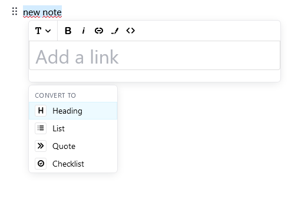

[](https://app.netlify.com/sites/notepad-rcl/deploys)

<br/>
<br/>
<br/>
<div align="center">
  <a href="https://github.com/texttree/notepad-rcl">
    
  </a>
<br/>
<br/>

<h2>Notepad Component Library</h2>

  <p>
    This component library allows you to create a Notepad with flexible text editing options.</p>

  <br/>

<a href="https://notepad-rcl.netlify.app/">View Demo</a>
·
<a href="https://github.com/texttree/notepad-rcl/issues">Report Bug</a>
·
<a href="https://github.com/texttree/notepad-rcl/issues">Request Feature</a>

</div>
  <br/>

**Key features:**
<br/>

- It is a block-styled editor based on [Editor.js](https://editorjs.io/)
- There is an autosave in browser
- Storing multiple notes

  <br/>

<details>
  <summary>Table of Contents</summary>
  <ol>
    <li>
      <a href="#about-the-project">About The Project</a>
      <ul>
        <li><a href="#built-with">Built With</a></li>
      </ul>
    </li>
    <li>
      <a href="#getting-started">Getting Started</a>
      <ul>
        <li><a href="#prerequisites">Prerequisites</a></li>
        <li><a href="#installation">Installation</a></li>
      </ul>
    </li>
    <li><a href="#usage">Usage</a></li>
    <li><a href="#roadmap">Roadmap</a></li>
    <li><a href="#contributing">Contributing</a></li>
    <li><a href="#license">License</a></li>
    <li><a href="#contact">Contact</a></li>
    <li><a href="#acknowledgments">Acknowledgments</a></li>
  </ol>
</details>

<br/>
<br/>

## About The Project

<a href="https://github.com/texttree/notepad-rcl">
    
  </a>

**Purpose**

- Convenient and compact note editor
- Note storage
- Note sharing
  <br/>

**Problem**

- The developer has a need to implement a convenient note-taking tool in his application
- While reading, studying Scripture, or translating, it is often necessary to take notes. You have to use third party apps.
  <br/>

### Built With

- [React](https://reactjs.org/)
- [Editor.js](https://editorjs.io/)
- [localforage](https://localforage.github.io/localForage/)

<br/>

## Getting Started

### Installation

1. Install the package:

```sh
yarn add @texttree/notepad-rcl
```

or

```sh
npm install @texttree/notepad-rcl
```

2. Import Redactor in app:

```js
import { Redactor } from '@texttree/notepad-rcl';

<Redactor />;
```

For more examples, please refer to the [Styleguidist link](https://notepad-rcl.netlify.app/)

<br/>

## Roadmap

See the [**open issues**](https://github.com/texttree/notepad-rcl/issues) for a full list of proposed features (and known issues).

<br/>

## Contributing

Contributions are what make the open source community such an amazing place to learn, inspire, and create. Any contributions you make are **greatly appreciated**. [**Guidelines for external contributions.**](https://forum.door43.org)

You can also simply open an issue with the tag "enhancement".
Don't forget to give the project a star! Thanks again!

If you would like to fork the repo and create a pull request.

1. Fork the Project
2. Create your Feature Branch (**`git checkout -b feature/AmazingFeature`**)
3. Commit your Changes (**`git commit -m 'Add some AmazingFeature'`**)
4. Push to the Branch (**`git push origin feature/AmazingFeature`**)
5. Open a Pull Request

<br/>

## License

Distributed under the MIT License. See [**LICENSE**](license-url) for more information.

<br/>

## Contact

TextTree - [**Discord**](https://discord.com/channels/867746700390563850/894978969613520956)

Project Link: [**https://github.com/texttree/notepad-rcl**](https://github.com/texttree/notepad-rcl)
